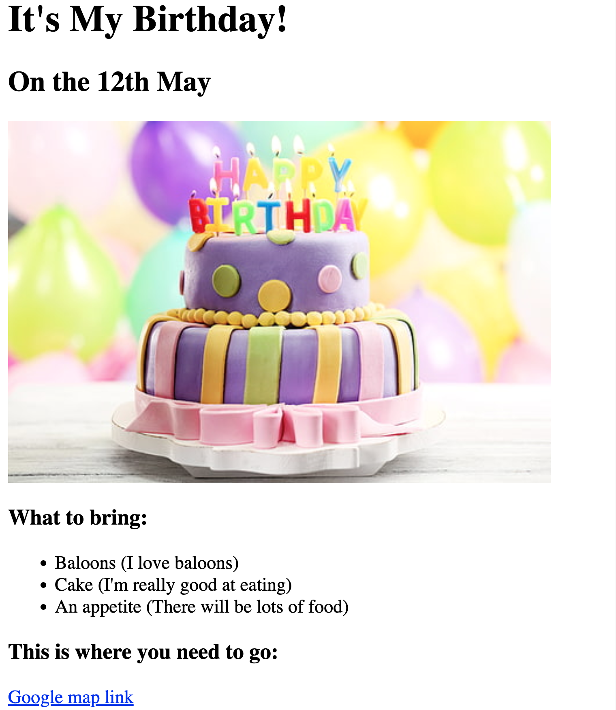

# 🎂 Birthday Invite Project

A simple birthday invitation webpage built using HTML5 with basic internal CSS styling. The page presents a birthday invitation along with the date, cake image, things to bring, and a Google Maps location link.

## 📸 Preview



## 🛠️ Technologies Used

* HTML5
* CSS3 — Basic internal styling

## ✨ Features

* Birthday invitation heading
* Birthday date display
* Birthday cake image
* List of things to bring
* Google Maps location link
* Simple and beginner-friendly webpage structure
* Basic font styling using internal CSS

## 📋 Invitation Details

**Birthday:** 20th October

### 🎁 What to Bring

1. Balloons
2. Cake
3. An appetite

### 📍 Location

The webpage includes a Google Maps link that opens the specified birthday location.

## 📚 What I Learned

* Creating a structured HTML5 webpage
* Using headings with `h1`, `h2`, and `h3`
* Adding images using the `` element
* Creating ordered lists using `<ol>` and `<li>`
* Creating external links using the `<a>` element
* Adding basic internal CSS styling
* Using `alt` text for images
* Creating a simple event invitation webpage

## 🚀 How to Run

1. Clone this repository.
2. Open the `Birthday Invite Project` folder.
3. Open `index.html` in your browser.
4. Make sure you have an active internet connection to load the external cake image.

## 📁 Project Structure

```text
Birthday Invite Project/
├── index.html
├── output.png
└── README.md
```

---

This project is part of my HTML & CSS learning journey.

**Learn → Practice → Build → Improve**
