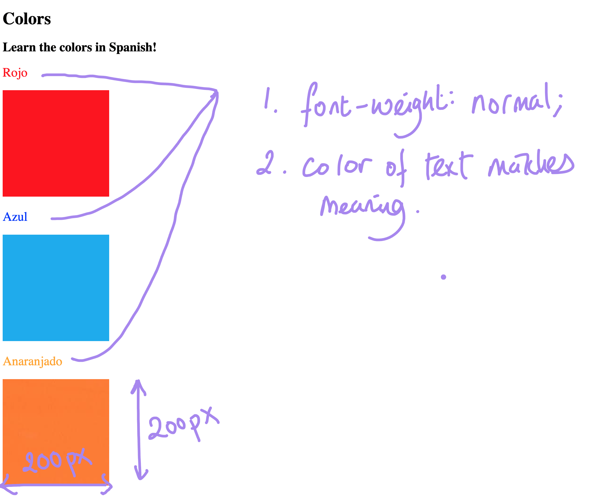

# 🎨 Color Vocab Project

A simple Spanish vocabulary webpage built using HTML5 and CSS3. The project helps users learn basic color names in Spanish through colored headings and corresponding images.

## 📸 Preview



## 🛠️ Technologies Used

* HTML5
* CSS3
* Flexbox

## ✨ Features

* Spanish vocabulary for common colors
* Color names displayed with matching text colors
* Image representation for each color
* Centered and vertically arranged layout
* Simple and beginner-friendly design
* External CSS stylesheet

## 🌈 Colors Included

| English | Spanish    |
| ------- | ---------- |
| Red     | Rojo       |
| Blue    | Azul       |
| Orange  | Anaranjado |
| Green   | Verde      |
| Yellow  | Amarillo   |

## 📚 What I Learned

* Creating a webpage using HTML5
* Linking an external CSS file
* Using CSS classes and IDs
* Applying different colors with CSS
* Using Flexbox for page layout
* Adding and sizing images with CSS
* Organizing images inside an assets folder
* Using `alt` attributes for images

## 📁 Project Structure

```text
Color Vocab Project/
├── index.html
├── style.css
├── output.png
├── README.md
└── assets/
    └── images/
        ├── red.png
        ├── blue.png
        ├── orange.png
        ├── green.png
        └── yellow.png
```

## 🚀 How to Run

1. Clone this repository.
2. Open the `Color Vocab Project` folder.
3. Open `index.html` in your browser.
4. The webpage will display the Spanish color vocabulary with their corresponding images.

---

This project is part of my HTML & CSS learning journey.

**Learn → Practice → Build → Improve**
