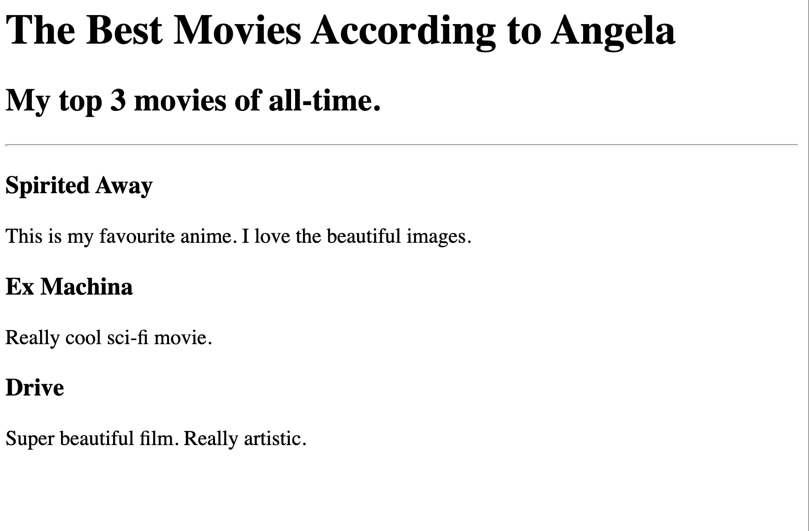

# 🎬 Movie Ranking Project

A simple **Movie Ranking webpage** created using HTML5 with basic internal CSS styling.

This is one of my beginner frontend projects, created to practice the fundamentals of HTML structure, headings, paragraphs, horizontal rules, and basic styling.

## 📸 Preview



## 🛠️ Technologies Used

* HTML5
* CSS3 — Basic internal styling

## ✨ Features

* Displays a personal top 3 movie list
* Uses different heading levels to create a clear content hierarchy
* Includes short descriptions for each movie
* Uses a horizontal divider to separate the heading section from the movie list
* Applies a basic font style using internal CSS

## 🎬 Movies Included

1. **The Incredible Hulk**
2. **Bal Hanuman**
3. **Avatar**

## 🎯 What I Learned

Through this project, I practiced:

* Creating a basic HTML document structure
* Using `<h1>`, `<h2>`, and `<h3>` headings
* Using `<p>` elements for descriptions
* Using the `<hr>` element
* Adding basic CSS inside an HTML `<style>` element
* Structuring content in a simple and readable way

## 🚀 How to Run

1. Clone the repository:

```bash
git clone https://github.com/adityakumar712/HTML-CSS-Projects.git
```

2. Open the project folder:

```text
01-movie-ranking
```

3. Open `index.html` in any modern web browser.

No additional installation or dependencies are required.

## 📂 Project Structure

```text
01-movie-ranking/
│
├── index.html
├── screenshot.png
└── README.md
```

---

⭐ **Part of my HTML & CSS learning journey.**

**Learn → Practice → Build → Improve 🚀**
