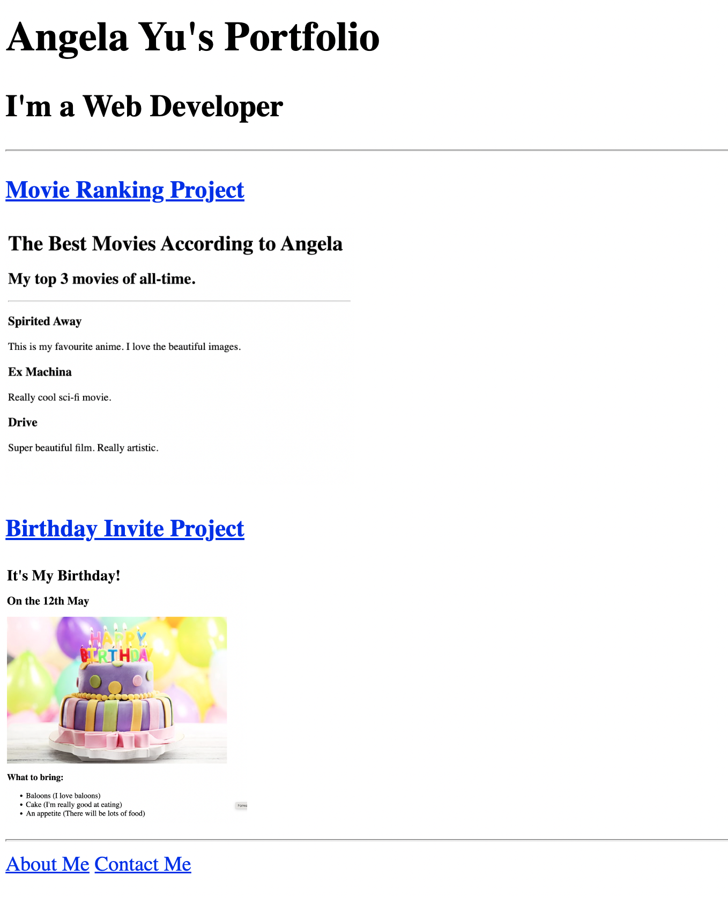

# 🌐 Portfolio Website

A simple personal portfolio website built using HTML5. The website introduces me as a web developer and showcases my projects through dedicated pages and preview images.

## 📸 Preview



## 🛠️ Technologies Used

* HTML5

## ✨ Features

* Personal portfolio homepage
* Introduction as a web developer
* Project showcase section
* Movie Ranking project preview
* Birthday Invite project preview
* About Me page
* Contact page
* Navigation between multiple HTML pages
* Project preview images
* Simple and beginner-friendly HTML structure

## 📂 Pages

### 🏠 Portfolio Home

The main page contains:

* Portfolio heading
* Web developer introduction
* Movie Ranking project link and preview
* Birthday Invite project link and preview
* Links to About Me and Contact pages

### 🎬 Movie Ranking

A separate HTML page showcasing a list of three favorite movies with short descriptions.

### 🎂 Birthday Invite

A birthday invitation webpage containing:

* Birthday date
* Birthday cake image
* Things to bring
* Google Maps location link

### 👤 About Me

A dedicated About Me page containing introductory personal information.

### 📞 Contact

A separate Contact page for contact information.

## 📚 What I Learned

* Creating a multi-page website using HTML5
* Linking different HTML pages using the `<a>` element
* Organizing website files into folders
* Adding images using the `` element
* Using relative paths for pages and images
* Creating a project showcase section
* Structuring content using headings, paragraphs, lists, and horizontal rules
* Building a basic personal portfolio website

## 📁 Project Structure

```text
Portfolio Website/
├── index.html
├── assets/
│   └── images/
│       ├── movie-ranking.png
│       └── birthday-invite.png
├── public/
│   ├── movie-ranking.html
│   ├── birthday-invite.html
│   ├── about.html
│   └── contact.html
├── output.png
└── README.md
```

## 🚀 How to Run

1. Clone this repository.
2. Open the `Portfolio Website` folder.
3. Open `index.html` in your browser.
4. Use the navigation links to explore the different pages.

---

This project is part of my HTML learning journey.

**Learn → Practice → Build → Improve**
