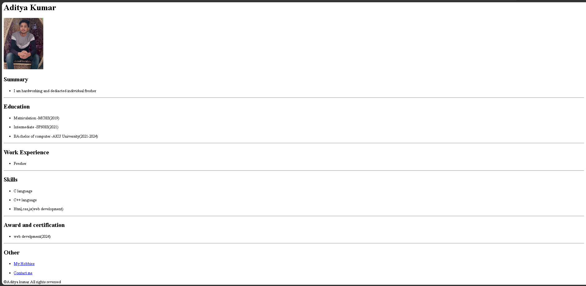

# 📄 Resume Portfolio 

A simple personal resume/portfolio website built using HTML5. The project contains a main resume page along with separate pages for hobbies and contact details.

## 📸 Preview



## 🛠️ Technologies Used

* HTML5

## ✨ Features

* Personal resume webpage
* Profile image
* Education details
* Work experience section
* Skills section
* Awards and certifications
* Hobbies page
* Contact page
* Navigation between multiple HTML pages
* Footer with copyright information

## 📑 Pages

### 🏠 Resume Page

The main `index.html` page contains:

* Name and profile picture
* Summary
* Education
* Work experience
* Skills
* Awards and certifications
* Links to hobbies and contact pages

### 🎯 Hobbies Page

The `my hobbies.html` page displays a list of hobbies:

* Playing cricket
* Reading books
* Listening to songs

### 📞 Contact Page

The `contact me.html` page contains contact information such as:

* Address
* Phone number
* Email address

## 📚 What I Learned

* Creating a complete HTML5 webpage
* Structuring a resume using headings and lists
* Adding images using the `` element
* Creating links between multiple HTML pages
* Using ordered and unordered lists
* Creating a footer section
* Organizing a website into multiple HTML files
* Building a basic personal portfolio/resume website

## 🚀 How to Run

1. Clone this repository.
2. Open the `Portfolio Project` folder.
3. Open `index.html` in your browser.
4. Use the links on the resume page to navigate to the hobbies and contact pages.

## 📁 Project Structure

```text
Portfolio Project/
├── index.html
├── my hobbies.html
├── contact me.html
├── mypic.jpg
├── output.png
└── README.md
```

---

This project is part of my HTML learning journey.

**Learn → Practice → Build → Improve**
